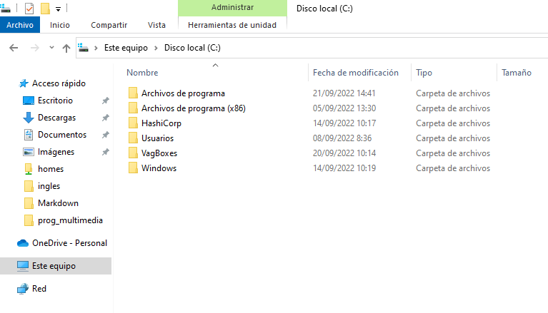
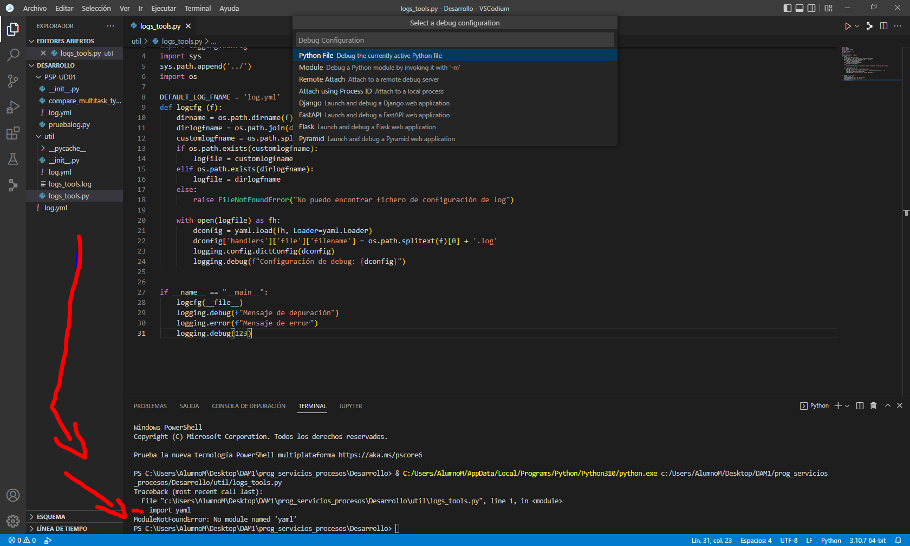
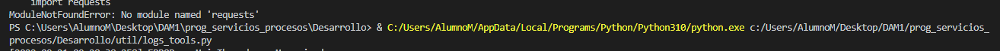

# Práctica 1: Comparación de métodos multitarea

## Documentación sobre la instalación de la aplicación

## Identificación:

Alumno: Eduardo Flores López

Ciclo: Desarrollo de Aplicaciones Multiplataforma

Centro Educativo: CES Afuera

# Objeto

Documentar la práctica 1 de la UD01 del módulo SGE relativa a la instalación de Odoo

# Ámbito

Evaluación continua del módulo DAM2-SGE en el CES Afuera (curso 22-23)

# Siglas

- PSP: es la abreviatura del documento PSP-UD01

# Enunciado

Esta primera práctica tiene por objeto ilustrar la eficiencia de los distintos métodos multitarea (multiproceso, multihilo, corrutinas) en Python para abordar un problema de uso intensivo de E/S.

Se trata también de que los alumnos instalen el entorno de trabajo VSCodium - Vagrant - Python y empiecen a trabajar con él con programas que necesitan más bibliotecas de las que vienen instaladas por defecto.

Los ficheros adjuntos se subieron al servidor de ficheros de clase:
- Enumerar los pre-requisitos necesarios para la práctica (por ejemplo: hw: ordenador con una configuración similar a la de clase, sw: sistema operativo, vagrant, virtualbox, VSCodium) (1 puno)
- Instalar los ficheros que definen la máquina virtual en el directorio adecuado (se sugiere que, si es en Windows, estén en c:\VagBoxes\PSP-UD01. (1 punto)
- Arranque de la máquina virtual (1 punto)
- Instalar el software Python en un directorio adecuado. Este software no debería colgar de VagBoxes, se sugiere que esté en la carpeta Desarrollo\PSP\ del directorio de usuario (1 punto)
- Probar el programa util\logs-tools.py. Probablemente haya que instalar bibliotecas adicionales (2 puntos)
- Probar el programa PSP-UD01\compare_multitask_types.py. Indicar qué procedimiento es el más rápido y cuál el más lento (2 puntos)
- Documentar el proceso de una forma sencilla, clara y limpia. Se sugiere, aunque en esta práctica, por haber empezado antes de su formalización como tarea, no se exiga, que se realice en formato markdown con la siguiente estructura (2 puntos)


## Prerrequisitos

| Software/Hardware | Requisitos mínimos
|---|---|
|SO | Windows 7/ Windows 8/ Windows 10
|Procesador | 2.0 GHz ó superior
|Memoria | 4 GB de RAM
|Gráficos | Nvidia GTX 650 / AMD HD 7750 ó superior ; 2G ó superior
|DirectX | Versión 9.0c
|Almacenamiento | 3 GB de espacio disponible
|Virtual Box | Versión recomendable 6.1.38 |
|Python | Versión recomendable 3.10.7 |

## Instalación de ficheros de la máquina virtual

- Para instalar Vagrant ejecutamos el documento vagrant_2.3.0_windows_amd64.msi
- Revisamos en cmd si Vagrant está instalado con el siguiente comando:
    ```cmd
    C:\Users\AlumnoM>vagrant -v
    ```
- Añadimos la carpeta VagBoxes a nuestro directorio C:\

    


## Arranque de la máquina virtual

Levantamos nuestra máquina con el siguiente comando dentro de la carpeta PSP:
```cmd
C:\VagBoxes\PSP-UD01>vagrant up
```

## Instalación de SW Python para pruebas
- Para instalar Python ejecutamos el documento python-3.10.7-amd64.exe
- Revisamos en cmd si Python está instalado con el siguiente comando:
    ```cmd
    C:\Users\AlumnoM>python
    ```

## Probar el programa util\logs-tools.py

- Abro y ejecuto el documento util\logs-tools.py en VSCodium:
    ```CMD
    Windows PowerShell
    Copyright (C) Microsoft Corporation. Todos los derechos reservados.

    Prueba la nueva tecnología PowerShell multiplataforma https://aka.ms/pscore6

    PS C:\Users\AlumnoM\Desktop\DAM1\prog_servicios_procesos\Desarrollo> & C:/Users/AlumnoM/AppData/Local/Programs/Python/Python310/python.exe c:/Users/AlumnoM/Desktop/DAM1/prog_servicios_procesos/Desarrollo/util/logs_tools.py
    [2022-09-22 10:18:39,254] ERROR    MainThread   - Mensaje de error
    PS C:\Users\AlumnoM\Desktop\DAM1\prog_servicios_procesos\Desarrollo> 
    ```
- Me aparecen 3 errores y estas son las formas de solucionarlo:

    Error debido a que no están instalados los paquetes yaml:
    
    Solución:
    ```cmd
    C:\VagBoxes\PSP-UD01>pip install yaml
    ```

    Error debido a que no están instalados los paquetes yaml:
    
    Solución:
    ```cmd
    C:\VagBoxes\PSP-UD01>pip install aiohttp
    ```

    Es posible que no estén instalados los request, por lo que hay que instalarlos con el siguiente comando:
    ```cmd
    C:\VagBoxes\PSP-UD01>pip install requests
    ```

    - Finalmente reviso el documento util\logs-tools.log:
    ```Python
    [2022-09-22 10:18:39,254] DEBUG    MainThread   - Mensaje de depuraci�n
    [2022-09-22 10:18:39,254] ERROR    MainThread   - Mensaje de error
    [2022-09-22 10:18:39,254] DEBUG    MainThread   - 123
    ```

## Probar el software compare_multitask_types.py

- En el documento compare_multitask_types.py ejecutamos y revisamos la URL para ver si convierte nuestro número decimal en binario:
    ```Python
    REQUESTS = [f'http://192.168.56.203:5000/dec2bin/{x}' for x in range(5_000)] 
    ```

- Introducimos la URL http://192.168.56.203:5000/dec2bin/123 en nuestro navegador para probar si convierte el número 1234(ejemplo) en binario:
